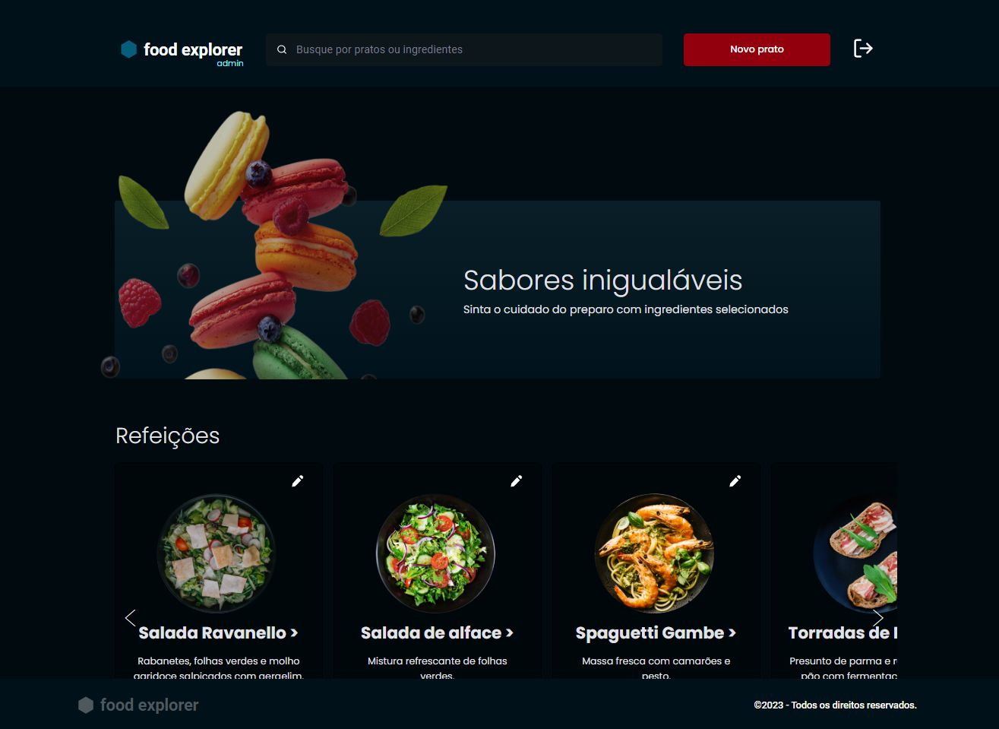

# Food Explorer

Projeto de um cardápio digital direcionado para ser usado por restaurantes com o intuito de ser utilizado como projeto final do curso de full-stack da RocketSeat sendo composto por `Front-End e Back-End`.

## 🚀 Começando

Clone o Front-End do meu repositório:
`https://github.com/LorrainePedro/FRONT_FOODEXPLORER.git`
 
Clone o Back-End do meu repositório: 

`https://github.com/LorrainePedro/BACKEND_FOODEXPLORER.git`

### 📋 Pré-requisitos

Será necessário ter no seu computador tanto o front-end quanto o back-end em execução para que o projeto rode de forma satisfatória.

Com ambos baixados, abrir ambas as pastas e clicar com o botão direito na raiz de cada uma delas e escolher
Abrir com Code(com o VScode devidamente instalado em sua máquina), abrir o terminal do vsCode e seguir o passo a passo de instalação seguinte.

Ou se preferir poderá acessar o projeto pelo terminal utilizando cd e arrastando a pasta do projeto para dentro do terminal.

### 🔧 Instalação Front-End

Para fazer a instalação de todas as dependências necessárias
`npm install`

Para executar o projeto em ambiente de desenvolvimento
`npm run dev`

Acesse a porta `http://localhost:3333`

`Deploy do projeto back-end pelo render: https://rocketfoods-api.onrender.com`
 

`Deploy do projeto front-end pelo netlify: https://heartfelt-kelpie-3c01d7.netlify.app`

Para ter acesso ao login de administrador e ter poderes de adicionar, atualizar e deletar pratos, utilize:
`login: admin`
`password: admin`

## 🛠️ Construído com

- Biblioteca para criação de interfaces: `reactJS`
- Setup para criar o projeto no React: `ViteJS`
- CSS-in-JS: `Styled-components`
- Biblioteca de ícones: `react-icons`
- Lib de navegação do projeto: `react-router-dom`

## ✒️ Autora

[Lorraine Pedro](https://github.com/LorrainePedro)

## Referência e apoio

[RocketSeat](https://www.rocketseat.com.br/)

Agradecimento aos colegas de turma que me apoiaram nessa reta final e dedicaram horas no discord para codar junto a mim em momentos de dificuldade.

# FRONT_FOODEXPLORER

